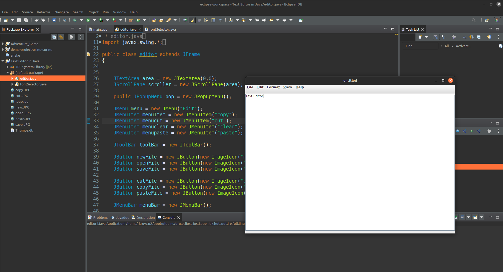

# Text Editor
A simple and efficient **Text Editor** developed in Java using the **Swing** library. This project provides basic text editing functionalities such as creating, opening, saving, and editing files in an easy-to-use graphical interface.

---

## Features
- **Create New Files:** Start working on a new document from scratch.
- **Open Existing Files:** Open `.txt` or similar text files for editing.
- **Save Files:** Save your work to a file on your system.
- **Basic Editing Tools:** Perform text editing operations like typing, deleting, and selecting text.
- **Graphical Interface:** User-friendly interface built using Java Swing components.

---

## Screenshots

---

## Getting Started
### Prerequisites
- Java Development Kit (JDK) version 8 or higher installed on your system.

### How to Run
1. Clone the repository:
   ```bash
   git clone https://github.com/RAJ8664/Projects
   ```
2. Navigate to the project directory:
   ```bash
   cd 'Text Editor in Java'
   ```
3. Compile the Java files:
   ```bash
   javac editor.java
   ```
4. Run the program:
   ```bash
   java editor
   ```

## How It Works
The **Text Editor** uses Java Swing components like `JTextArea`, `JMenuBar`, and `JFileChooser` to provide a graphical user interface. File handling operations are implemented using Java I/O classes to read and write text files efficiently.


## Contact
For any queries or suggestions, feel free to reach out:

- **GitHub:** [RAJ8664](https://github.com/RAJ8664)
- **Email:** rajr86642@gmail.com
