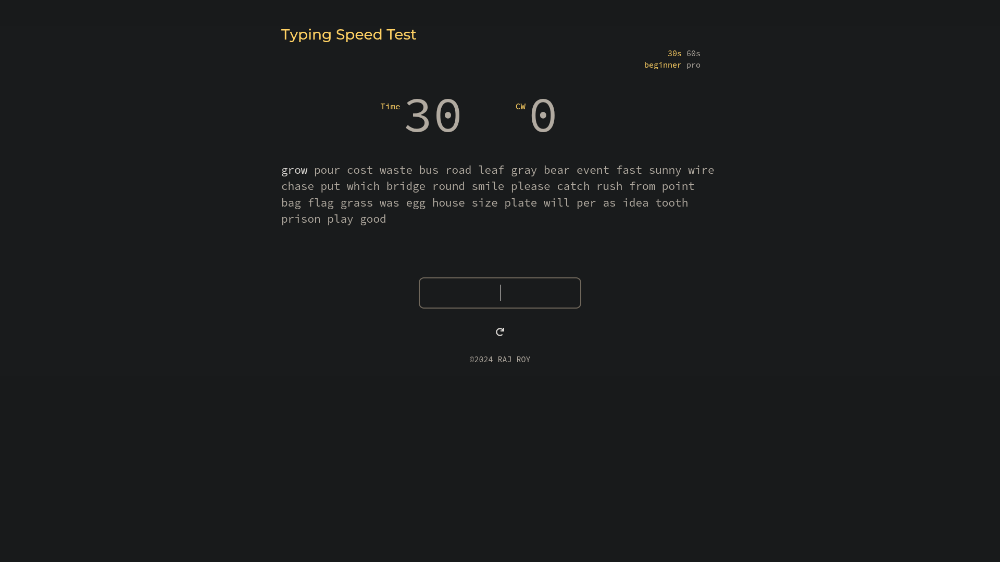
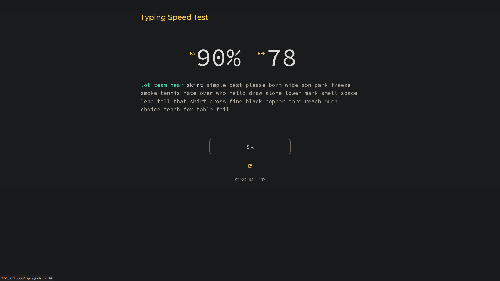

# ⌨️ Typing Test Application

Level up your typing skills with the **Typing Test Application** : a sleek, web-based tool designed to help you type faster, smarter, and more accurately. Whether you're practicing for fun or sharpening your productivity, this app makes improvement engaging and measurable.

## 🚀 Features

✨ **Live Typing Stats**  
Track your **Words Per Minute (WPM)** and **accuracy** in real time as you type.

🧠 **Custom Test Modes**  
Choose from multiple test lengths and difficulty levels tailored to your comfort and challenge needs.

📈 **Progress Tracking**  
Review your past performances and visually see how your typing skills improve over time.

📱 **Fully Responsive UI**  
Optimized for desktops, tablets, and mobile devices — type anywhere, anytime.

## 🖥️ Preview

### Typing Test Interface



### Results Dashboard



> _Detailed performance breakdown displayed after each test._

## 🐳 Run with Docker (Quick Start)

Get up and running instantly using Docker:

```bash
docker pull rkroy/typing-test:latest
docker run -p 8080:8080 rkroy/typing-test:latest
```

Then open your browser and visit:
👉 **[http://localhost:8080](http://localhost:8080)**

## 🛠️ Getting Started (Local Setup)

Follow these steps to run the project locally for development or customization.

### Prerequisites

Make sure you have:

- **Visual Studio Code**
- **Live Server extension** for VS Code

🔗 Downloads:

1. [Visual Studio Code](https://code.visualstudio.com/Download)
2. Live Server (via VS Code Extensions Marketplace)

### 📦 Installation

Clone the repository and open it in VS Code:

```bash
git clone https://github.com/RAJ8664/Projects/tree/main/Typing
cd Typing
code .
```

### ▶️ Run the App

1. Locate `index.html` in the VS Code sidebar
2. Right-click on it
3. Select **“Open with Live Server”**

Your browser will automatically launch the application 🎉

## 🧩 Tech Stack

Built using modern web fundamentals:

- **HTML** – Structure
- **CSS** – Styling
- **JavaScript** – Logic & Interactivity
